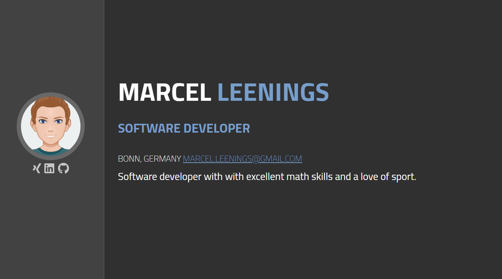

# Personal resume by Angular
[](https://www.codacy.com/manual/mleenings/cv?utm_source=github.com&amp;utm_medium=referral&amp;utm_content=mleenings/cv&amp;utm_campaign=Badge_Grade)
[](https://www.gnu.org/licenses/gpl-3.0) 
[](https://GitHub.com/Naereen/StrapDown.js/graphs/commit-activity)
[](http://hits.dwyl.io/mleenings/cv)


simple personal resume application created by Angular and Github pages.

 [Live Demo](https://mleenings.github.io/cv/)


## PREVIEW




## USAGE

#### 1 - clone the repository 

```shell
git clone https://github.com/mleenings/cv.git
```

you can also make a fork on your github account. 

#### 2 - installing the dependencies
```shell
cd cv 
npm install 
npm install -g angular-cli-ghpages
```

#### 3 - setting your personal data

for that, you have juste to edited the file _src/assets/data/perso.json_

NB : for the skills part, you need to choose an icon from [Fontawesome's gallery](https://fontawesome.com/icons?d=gallery).


#### 4 - deploying the app on Github pages 

Github offers the possibility to host an angular application for free through the Github pages feature, and it's really simple by using the node package **angular-cli-ghpages**.

NB: you need to make a fork or a copy of the repository on your github account to be able to share the app on your github pages.


```shell
ng build --prod --base-href https://[username].github.io/[repo]/

ngh --no-silent
```

after that you can visit your personal page on **https://[username].github.io/[repo]**


#### 5 - Advanced use

```shell
ng serve
```

## Contributing

All bug reports and pull requests are welcome. 
